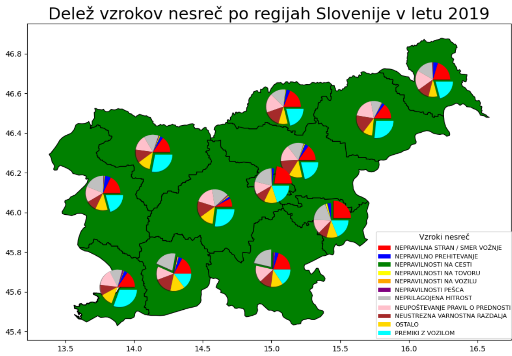
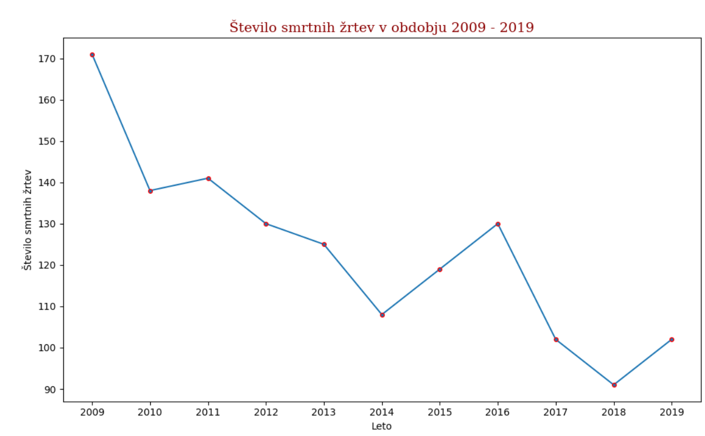
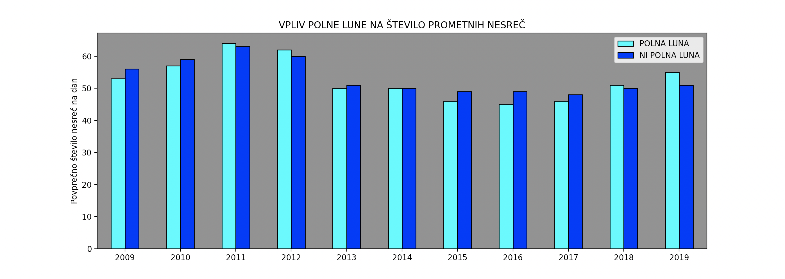

# Projektna naloga pri Programiranju 2

**Tema za seminarsko:**
Analiza prometnih nesreč v Sloveniji

**V paru:**
> Damijan Randl 

> Benisa Risović

**Namen projekta:** filtriranje, urejanje in analiza (primerjava) podatkov o prometnih nesrečah v Sloveniji.

**Knjižnice, ki jih potrebuje uporabnik:**

- requests
- matplotlib.pyplot
- ephem 
- urllib.requests
- zipfile 
- numpy
- pandas 
- geopandas (in pripadajoče knjižnice)

**Opomba:**
Za nemoteno in hitrejše delovanje programa uporabnik potrebuje datoteko: karta_slovenije. 
(V python datoteki funkcije.py je v 318. vrstici na voljo tudi trenutno zakomentiran ukaz, ki prenese datoteko neposredno iz spleta.)

**Analize, ki so na voljo:**

> Analiza števila prometnih nesreč

> Analiza nesreč v odvisnosti od letnih časov

> Analiza števila smrtnih žrtev

> Analiza vrste poškodbe v odvisnosti od uporabe varnostnega pasu

> Analiza najpogostejših vzrokov nesreč v statističnih regijah 

> Analiza povzročiteljev nesreč glede na starost

> Analiza vpliva polne lune na število prometnih nesreč

> Analiza pogostosti prometnih nesreč v statističnih regijah

> Analiza udeležencev pozitivnih na alkotest 

# Komentarji analiz:

 Največja zgostitev števila prometnih nesreč je v Osrednjeslovenski regiji.
 Skladno s pričakovanji, največ prometa, posledično tudi prometnih nesreč je v dveh urbanih središčih države: Ljubljana in Maribor.

Za vsako regijo je na tortnem diagramu mogoče odčitati izstopajoči vzrok nesreče.

Intuitivno lahko upad števila smrtnih žrtev iz preteklih let do leta 2019 pripišemo:

> varnejšim in bolj opremljenim vozilom

> hitrejši intervenciji nujne medicinske pomoči na cesti

> boljšemu stanju cest

Na podlagi dobljenih podatkov analize, sklepamo, da polna luna ne vpiva na vvoznikove sposobnosti, ki so potrebne za varno vožnjo.
